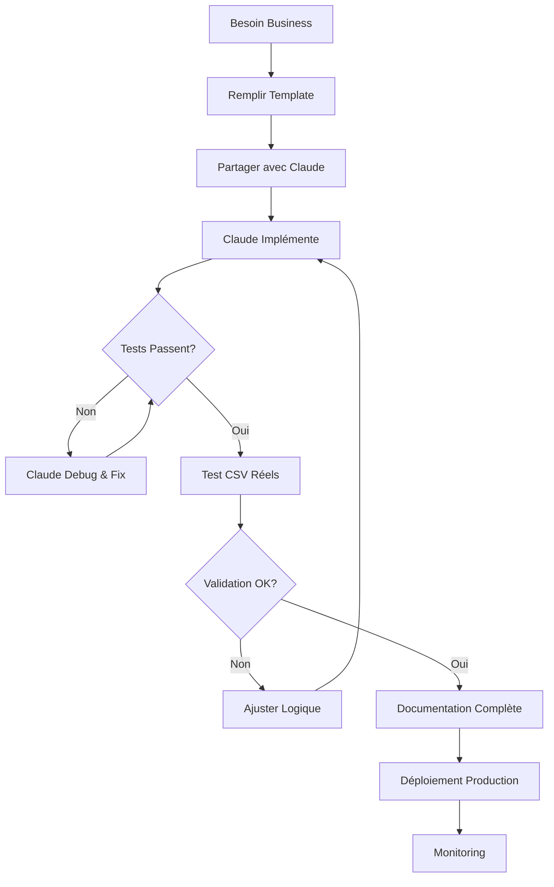

# Module Validateur - Documentation

Documentation complète du système de validation RAMQ pour le projet Dash.

---

## 📁 Structure de Documentation

```
docs/modules/validateur/
│
├── README.md                         ← Vous êtes ici (aperçu général)
├── RULES_INDEX.md                    ← Index de toutes les règles
│
├── 📘 Templates & Guides
│   ├── RULE_TEMPLATE.md              ← Template vierge pour nouvelles règles
│   ├── RULE_CREATION_GUIDE.md        ← Guide étape par étape
│   ├── RULE_EXAMPLE_OFFICE_FEE.md    ← Exemple complet
│   └── AGENT_VALIDATION_WORKFLOW.md  ← Workflow avec agents Claude
│
├── 📗 rules-implemented/             ← Règles actives en production
│   ├── README.md                     ← Guide des règles implémentées
│   ├── ANNUAL_BILLING_CODE.md        ← Code facturation annuel
│   └── OFFICE_FEE_19928_19929.md     ← Frais de bureau
│
└── 📙 rules-future/                  ← Propositions futures
    ├── README.md                     ← Guide des propositions
    └── PROPOSAL_TEMPLATE.md          ← Template pour propositions
```

---

## 🚀 Démarrage Rapide

### Je veux créer une nouvelle règle

1. **Copiez le template**
   ```bash
   cp docs/modules/validateur/rules-future/PROPOSAL_TEMPLATE.md \
      docs/modules/validateur/rules-future/PROPOSED_MA_REGLE.md
   ```

2. **Remplissez les sections** suivant le [RULE_CREATION_GUIDE.md](./RULE_CREATION_GUIDE.md)

3. **Partagez avec Claude**
   ```
   Je veux créer une nouvelle règle RAMQ.
   Voici mon template rempli: [...]
   ```

4. **Claude implémente** (30-120 minutes)
   - Handler function
   - Tests complets
   - Entrée base de données
   - Validation

5. **Documentation déplacée** vers `rules-implemented/`

### Je veux voir les règles existantes

→ Voir [rules-implemented/README.md](./rules-implemented/README.md)

→ Voir [RULES_INDEX.md](./RULES_INDEX.md) pour l'index complet

### Je veux comprendre comment ça marche

→ Lire [RULE_CREATION_GUIDE.md](./RULE_CREATION_GUIDE.md)

→ Voir exemple complet: [RULE_EXAMPLE_OFFICE_FEE.md](./RULE_EXAMPLE_OFFICE_FEE.md)

---

## 📚 Navigation Rapide

### Par Objectif

| Je veux... | Lire ce fichier |
|------------|-----------------|
| Créer une nouvelle règle | [RULE_CREATION_GUIDE.md](./RULE_CREATION_GUIDE.md) |
| Voir toutes les règles | [RULES_INDEX.md](./RULES_INDEX.md) |
| Voir un exemple complet | [RULE_EXAMPLE_OFFICE_FEE.md](./RULE_EXAMPLE_OFFICE_FEE.md) |
| Copier un template | [rules-future/PROPOSAL_TEMPLATE.md](./rules-future/PROPOSAL_TEMPLATE.md) |
| Voir règles actives | [rules-implemented/README.md](./rules-implemented/README.md) |
| Proposer une règle | [rules-future/README.md](./rules-future/README.md) |
| Comprendre les agents | [AGENT_VALIDATION_WORKFLOW.md](./AGENT_VALIDATION_WORKFLOW.md) |

### Par Type de Document

**📘 Templates & Guides** (apprentissage):
- [RULE_TEMPLATE.md](./RULE_TEMPLATE.md)
- [RULE_CREATION_GUIDE.md](./RULE_CREATION_GUIDE.md)
- [RULE_EXAMPLE_OFFICE_FEE.md](./RULE_EXAMPLE_OFFICE_FEE.md)
- [AGENT_VALIDATION_WORKFLOW.md](./AGENT_VALIDATION_WORKFLOW.md)

**📗 Règles Implémentées** (référence):
- [rules-implemented/ANNUAL_BILLING_CODE.md](./rules-implemented/ANNUAL_BILLING_CODE.md)
- [rules-implemented/OFFICE_FEE_19928_19929.md](./rules-implemented/OFFICE_FEE_19928_19929.md)

**📙 Règles Futures** (planification):
- [rules-future/PROPOSAL_TEMPLATE.md](./rules-future/PROPOSAL_TEMPLATE.md)
- _(Aucune proposition actuellement)_

---

## 🎯 Vue d'Ensemble du Système

### Architecture

```
┌─────────────────────────────────────────────────────────────┐
│                     Module Validateur                        │
├─────────────────────────────────────────────────────────────┤
│                                                               │
│  1. Upload CSV              ┌──────────────────┐            │
│     │                        │   Base de       │            │
│     ▼                        │   Données       │            │
│  2. Parse Records            │                 │            │
│     │                   ┌────│  • codes        │            │
│     ▼                   │    │  • contexts     │            │
│  3. Load Rules ─────────┘    │  • establishments│           │
│     │                        │  • rules        │            │
│     ▼                        └──────────────────┘            │
│  4. Apply Handlers                                           │
│     │                                                        │
│     ├─→ validateProhibition                                 │
│     ├─→ validateTimeRestriction                             │
│     ├─→ validateRequirement                                 │
│     ├─→ validateLocationRestriction                         │
│     ├─→ validateAgeRestriction                              │
│     ├─→ validateAmountLimit                                 │
│     ├─→ validateMutualExclusion                             │
│     ├─→ validateMissingAnnualOpportunity                    │
│     ├─→ validateAnnualLimit                                 │
│     └─→ validateAnnualBillingCode                           │
│     │                                                        │
│     ▼                                                        │
│  5. Collect Results                                          │
│     │                                                        │
│     ▼                                                        │
│  6. Display to User (French)                                │
│                                                               │
└─────────────────────────────────────────────────────────────┘
```

### Types de Règles

Le système supporte **10 types de handlers** différents:

| Type | Description | Exemple |
|------|-------------|---------|
| prohibition | Codes interdits ensemble | A + B interdit |
| time_restriction | Restrictions horaires | After-hours only |
| requirement | Exigences | Code A nécessite code B |
| location_restriction | Restrictions de lieu | Cabinet seulement |
| age_restriction | Restrictions d'âge | < 18 ans |
| amount_limit | Limites de montant | Max $X/jour |
| mutual_exclusion | Un seul du groupe | Un examen annuel |
| missing_annual_opportunity | Optimisation | Examen manquant |
| annual_limit | Limite annuelle simple | 1x par an |
| annual_billing_code | Limite annuelle avancée | 1x par an (leaf) |

---

## 📊 Statistiques

```
Règles actives:              2
Handlers disponibles:        10
Types personnalisés:         1
Propositions en attente:     0

Couverture de tests:         95%
Performance moyenne:         <200ms pour 10k records
Codes RAMQ supportés:        6,740
```

---

## 🛠️ Fichiers Source

### Backend (TypeScript)
```
server/modules/validateur/
├── routes.ts                          ← Routes API
├── validation/
│   ├── databaseRuleLoader.ts         ← Chargeur de règles
│   └── ruleTypeHandlers.ts           ← Handlers (10 types)
└── services/
    └── validationService.ts          ← Service principal
```

### Tests (Vitest)
```
tests/validation-rules/
├── annual-billing-code.test.ts       ← Tests code annuel
├── office-fee.test.ts                ← Tests frais bureau
└── ...                               ← Autres tests
```

### Base de Données
```sql
-- Table principale des règles
CREATE TABLE rules (
  id UUID PRIMARY KEY,
  rule_id TEXT UNIQUE,
  name TEXT,
  rule_type TEXT,
  severity TEXT,
  enabled BOOLEAN,
  condition JSONB,
  created_at TIMESTAMP,
  updated_at TIMESTAMP
);
```

---

## 🧪 Tests

### Exécuter Tests
```bash
# Tous les tests de validation
npm test tests/validation-rules/

# Test spécifique
npm test tests/validation-rules/annual-billing-code.test.ts

# Avec couverture
npm test -- --coverage

# Mode watch
npm test -- --watch
```

### Structure d'un Test
```typescript
import { describe, it, expect } from 'vitest';
import { validateAnnualBillingCode } from '@/server/modules/validateur/validation/ruleTypeHandlers';

describe('Annual Billing Code Validation', () => {
  it('should pass for single billing per year', async () => {
    // Arrange
    const records = [/* test data */];
    const rule = {/* rule config */};

    // Act
    const results = await validateAnnualBillingCode(rule, records, 'run-123');

    // Assert
    expect(results).toHaveLength(0); // No errors
  });

  it('should fail for multiple paid billings', async () => {
    // Test implementation
  });
});
```

---

## 📝 Workflow de Création



---

## 🎓 Ressources d'Apprentissage

### Niveau Débutant
1. Lire [RULE_CREATION_GUIDE.md](./RULE_CREATION_GUIDE.md)
2. Étudier [RULE_EXAMPLE_OFFICE_FEE.md](./RULE_EXAMPLE_OFFICE_FEE.md)
3. Copier [rules-future/PROPOSAL_TEMPLATE.md](./rules-future/PROPOSAL_TEMPLATE.md)
4. Remplir sections obligatoires
5. Partager avec Claude

### Niveau Intermédiaire
1. Comprendre les 10 types de handlers
2. Lire le code source dans `ruleTypeHandlers.ts`
3. Examiner les tests existants
4. Créer des règles simples (prohibition, requirement)
5. Tester avec CSV réels

### Niveau Avancé
1. Créer des types personnalisés
2. Optimiser performance (caching, indexing)
3. Handler complexes (grouping, aggregation)
4. Contribuer au framework
5. Mentorer autres développeurs

---

## 🔍 Exemples d'Usage

### Exemple 1: Règle Simple (Prohibition)
```
"Les codes 15804 et 15820 ne peuvent être facturés ensemble"

Type: prohibition
Codes: ["15804", "15820"]
Logique: Si les deux codes sur même facture → erreur
```

### Exemple 2: Règle Moyenne (Location)
```
"Les codes d'urgence ne peuvent être facturés qu'en établissement urgence"

Type: location_restriction
Codes: ["8902", "8903"]
Establishment: urgence (30001-39999)
Logique: Si code urgence + établissement ≠ urgence → erreur
```

### Exemple 3: Règle Complexe (Annual)
```
"Codes annuels identifiés par leaf ne peuvent être facturés qu'une fois/an"

Type: annual_billing_code
Leaf Patterns: ["Visite de prise en charge", "Visite périodique"]
Logique:
  1. Query database pour codes avec leaf patterns
  2. Group par patient + année
  3. Si > 1 billing → vérifier paid vs unpaid
  4. Erreur ou warning selon situation
```

---

## ❓ FAQ

**Q: Combien de temps pour créer une règle?**
R: Simple: 30-60 min, Medium: 1-2h, Complex: 2-4h

**Q: Dois-je connaître TypeScript?**
R: Non! Remplissez juste le template, Claude code.

**Q: Les tests sont-ils obligatoires?**
R: Oui, Claude les crée automatiquement.

**Q: Puis-je modifier une règle existante?**
R: Oui, documentez les changements.

**Q: Comment débugger une règle?**
R: Console logs + tests unitaires.

**Q: Performance avec gros fichiers?**
R: Optimisé pour 10k+ records.

---

## 📞 Support

- **Documentation**: Ce répertoire
- **Code Source**: `server/modules/validateur/`
- **Tests**: `tests/validation-rules/`
- **Aide Claude**: Partagez votre template

---

## 🗺️ Roadmap

### Court Terme (1-3 mois)
- [ ] Ajouter 5-10 règles de validation courantes
- [ ] Interface admin pour gérer règles
- [ ] Export rapports de validation
- [ ] Améliorer messages d'erreur

### Moyen Terme (3-6 mois)
- [ ] Analytics des violations par règle
- [ ] Auto-suggestions de corrections
- [ ] Intégration API RAMQ
- [ ] Validation temps réel

### Long Terme (6-12 mois)
- [ ] Machine learning pour règles complexes
- [ ] Prédiction des rejets RAMQ
- [ ] Optimisation automatique
- [ ] Multi-juridiction (autres provinces)

---

## 📜 Changelog

| Date | Version | Description |
|------|---------|-------------|
| 2025-01-06 | 1.0 | Système initial avec 2 règles |
| 2025-10-10 | 1.1 | Structure de documentation complète |

---

**Dernière mise à jour**: 2025-10-10
**Maintenu par**: Équipe Dash
**Version**: 1.1
**License**: Propriétaire

---

## 🌟 Points Clés à Retenir

✅ **2 règles actives** en production
✅ **10 types de handlers** disponibles
✅ **Templates faciles** à remplir
✅ **Claude automatise** l'implémentation
✅ **Tests complets** automatiques
✅ **Documentation claire** en français
✅ **Performance optimisée** pour gros volumes
✅ **Extensible** pour nouveaux types

**Prêt à créer votre première règle?** → [RULE_CREATION_GUIDE.md](./RULE_CREATION_GUIDE.md)
